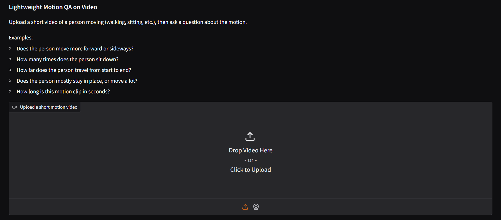
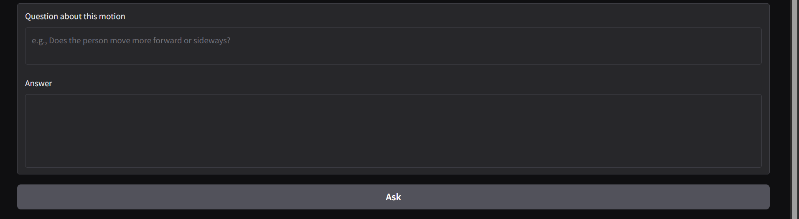

> Built a CPU-only Motion Question Answering prototype on 3D motion data and raw videos.  
> Implemented a pipeline that extracts root trajectories from AMASS CMU `.npz` files and MediaPipe Pose, computes interpretable motion features (displacement, duration, sit events), and answers natural language questions via a modular toolbox of motion-analysis functions (dominant direction, sit counts, displacement, movement category, clip duration). Exposed the system via a CLI over an AMASS/BABEL-style subset and a Gradio-based web app that supports video uploads, with optional LLM-based planning/answering.
# Lightweight Motion QA
A small, **CPU-friendly Motion Question Answering system** that can:

- Analyze **3D motion clips** derived from AMASS (CMU subset) via a CLI.
- Analyze **short human-movement videos** (via MediaPipe Pose) through a **web UI**.
- Answer simple questions like:
  - *“Does the person move more forward or sideways?”*
  - *“How many times does the person sit down?”*
  - *“How far does the person travel?”*
  - *“Does the person mostly stay in place, or move a lot?”*
  - *“How long is this motion clip in seconds?”*

By default, everything runs **offline on CPU** using hand-crafted motion features and simple rule-based logic.  
There are optional hooks for LLM-based planning/answering (OpenAI API), controlled via a config flag.

---

## 1. Project Overview

**Goal:**  
Build a lightweight Motion QA system that:

- Works on **3D motion data** (AMASS/BABEL-style) and on **raw videos**.
- Stays **GPU-free** and relatively simple.
- Uses modular motion-analysis tools.

### Core pipeline

Regardless of source (AMASS or video):

1. **Motion Representation**  
   Motion is represented as a tensor of shape `(T, J, 3)`:
   - `T` = number of frames
   - `J` = number of joints (currently `J=1` → only the root)
   - `3` = `(x, y, z)` coordinates

2. **Feature Extraction** (`motion_qa/features.py`)  
   - `compute_basic_features`: root displacement, per-joint path length, etc.
   - `compute_features_with_events`: adds event-like features (e.g., sit events).

3. **Motion Modules** (`motion_qa/modules.py`)  
   Interpretable tools that run on `(motion, features)`:
   - `dominant_direction`
   - `count_sit_events`
   - `global_displacement`
   - `displacement_category`
   - `clip_duration`
   - `most_active_limb` (more meaningful once multi-joint skeletons are used)

4. **Planner** (`motion_qa/planner.py`)  
   Chooses which tool to call given a natural language question:
   - `plan_from_question` – heuristic keyword-based (default).
   - `plan_from_question_llm` – optional OpenAI-based planner.

5. **Answerer** (`motion_qa/answerer.py`)  
   Turns raw numeric results into human-readable text:
   - `format_answer` – rule-based (default).
   - `answer_with_llm` – optional OpenAI-based answerer.

6. **Interfaces**
   - **CLI app** (`scripts/cli_app.py`) for exploring AMASS-derived clips.
   - **Web app** (`scripts/app_web.py`) for uploading **videos** and asking questions in the browser.

>  Note: at this stage, there is **no training** loop or learned model; everything is rule-based analytics on motion. The only ML models used are **pretrained** ones (MediaPipe Pose, optional LLM).

---

## 2. Repository Structure

Rough layout:

```text
.
├── motion_qa/
│   ├── __init__.py
│   ├── config.py           # USE_LLM flag, model names, etc.
│   ├── datasets.py         # MotionQADataset (AMASS/BABEL subset)
│   ├── features.py         # motion feature computation
│   ├── modules.py          # motion analysis tools (dominant_direction, etc.)
│   ├── planner.py          # heuristic + optional LLM-based planning
│   ├── answerer.py         # rule-based + optional LLM-based answerer
│   └── video_pose.py       # MediaPipe-based video → motion (T, 1, 3)
│
├── scripts/
│   ├── preprocess_babel_subset.py  # build small AMASS/BABEL-like subset
│   ├── run_demo.py                 # simple one-clip demo (terminal)
│   ├── cli_app.py                  # CLI interface over dataset
│   └── app_web.py                  # Gradio web app: upload video + question
│
├── data/
│   ├── CMU/               # AMASS CMU .npz files (not committed)
│   ├── babel/             # BABEL JSON files (optional, not heavily used yet)
│   └── babel_subset/      # Generated subset: motions/ + metadata.json
│
├── .env                   # config flags, OpenAI key, etc. (ignored by git)
├── requirements.txt        # torch, numpy, mediapipe, opencv-python, gradio, ...
└── README.md               # this file
````

---

## 3. Installation

### 3.1. Python & virtual environment

```bash
python -m venv venv
# Windows:
venv\Scripts\activate
# macOS / Linux:
# source venv/bin/activate
```

### 3.2. Install dependencies
```bash
pip install torch numpy matplotlib mediapipe opencv-python gradio python-dotenv openai
```

Or, if you have `requirements.txt`:
```bash
pip install -r requirements.txt
```

---

## 4. Data Setup (AMASS / BABEL Subset)

This is for the **dataset-based** part (CLI and `run_demo.py`).
1. **AMASS CMU (SMPL+H G)**
    
    - Download the CMU subset of **AMASS** (SMPL+H G version).
        
    - Extract all `.npz` such that they live under:
        
        ```text
        data/CMU/01/...
        data/CMU/02/...
        ...
        ```
        
2. (**Optional**) **BABEL JSONs**
    
    - Download BABEL JSON annotations and put them here:
        
        ```text
        data/babel/train.json
        data/babel/val.json
        data/babel/test.json
        data/babel/extra_train.json
        data/babel/extra_val.json
        ```
        
    
    They are not heavily used yet but match the intended structure.
    
3. **Preprocess into a lightweight subset**
    
    From the project root:
 ```bash
    python -m scripts.preprocess_babel_subset
    ```
    
    This will:
    
    - Traverse `data/CMU/` for `.npz`.
    - Extract root joint trajectories (`(T, 1, 3)`) using:
        - `joints` if available, otherwise
        - `trans` as a single “root” joint.
    - Create `data/babel_subset/motions/*.npy`.
    - Create `data/babel_subset/metadata.json` with pre-generated QA entries.
    After this, you should see logs like:
    ```text
    [info] Found XXX .npz files, selecting ALL of them.
    [info] Processing data/CMU/01/xxx.npz
           shape: T=..., J=1
    ...
    [done] Wrote metadata for N clips to data/babel_subset/metadata.json
    ```
---
## 5. Dataset-Based Interfaces

### 5.1. Simple demo (`run_demo.py`)
Quick one-clip demo in terminal:
```bash
python -m scripts.run_demo
```
Sample output:

```text
[info] Dataset size: 5
[info] Using item index: 0
[info] Clip ID: babel_clip_0000
[info] Motion shape: (2751, 1, 3) (T, J, 3)
[info] Question: Does the person move more forward or sideways?
[config] USE_LLM=False -> using heuristic planner + rule-based answerer.
[info] Planner chose tool: dominant_direction with params={}
[info] Raw module output: {'type': 'categorical', 'value': 'left', 'details': {'lr': 3.16, 'fb': -0.00}}

------------------------------------------------------------
Q: Does the person move more forward or sideways?
A: The person moves mostly left (left-right displacement=3.16, forward-back=-0.00).
------------------------------------------------------------
```
---

## 5. Video-Based Web App

Upload a small video, ask a question, get an answer in the browser.

### 5.1. Video → Motion (`motion_qa/video_pose.py`)

- Uses **MediaPipe Pose** to extract pose from each frame.
- Takes the **midpoint of left & right hip** as the “root” joint.
- Produces an array `(T, 1, 3)` of normalized `(x, y, z)` coordinates in image space.
- This motion representation is then fed into the same feature + module pipeline as AMASS.

### 5.2. Web App (`scripts/app_web.py`)

Launch the web UI:
```bash
python -m scripts.app_web
```
## Output



## 6. Configuration & LLM Integration

Config is handled in `motion_qa/config.py` via environment variables (`.env`):
```env
USE_LLM=false
PLANNER_MODEL=gpt-4.1-mini
ANSWER_MODEL=gpt-4.1-mini
OPENAI_API_KEY=sk-...
```

- When `USE_LLM=false` (default):
    - Planner → `plan_from_question` (heuristic).
    - Answerer → `format_answer` (rule-based).
    - No OpenAI calls are made.
        
- When `USE_LLM=true`:
    - Planner → `plan_from_question_llm` (with OpenAI).
    - Answerer → `answer_with_llm`.
    - Both will fall back to heuristic / rule-based if any error or missing key occurs.
        

---

## 7. Limitations & Future Work

**Current limitations:**
- Uses only a **single root joint** `(T, 1, 3)`:
    - From AMASS (`trans`) or from MediaPipe hip midpoint.
    - Limb-related tools like `most_active_limb` are placeholders until multi-joint skeletons are integrated.
    
- **No training** yet:
    - All modules are rule-based (no learned models trained on this code).
        
- BABEL is not yet directly used for labels/text beyond mirroring its structure.
    

**Future directions:**
- Reconstruct full multi-joint skeletons using SMPL-H on AMASS.
- Use all MediaPipe joints for richer video motion representation `(T, J, 3)`.
- Make `most_active_limb` and other limb-focused tools truly meaningful.
- Train a **small classifier** on top of features (e.g., movement intensity or action type) to add explicit ML.
- Deeper integration of BABEL text (e.g., question templates or supervision).
- Richer web UI:
    - Skeleton overlays,
    - timelines,
    - multiple questions per clip.
        
---
