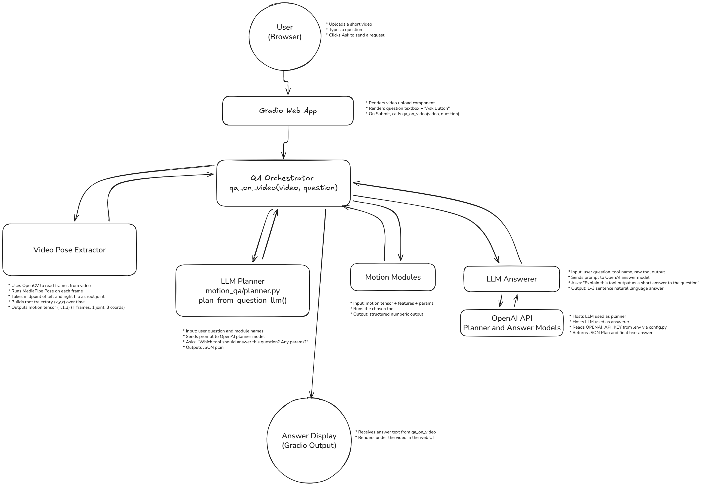

# Lightweight Motion QA

A small project that lets you **ask questions about human movement** over short videos uploaded through a web interface. The system extracts motion features (like displacement, duration, sit events), runs lightweight motion-analysis modules in PyTorch, and then uses an OpenAI model to decide *which* module to call and *how* to phrase the final answer.


---

## What can I do with this?


- Upload a **short video** of a person moving and:
  - Automatically extract a simple root trajectory using MediaPipe Pose.
  - Ask questions about the motion directly from the browser like:
    - “Does the person move more forward or sideways?”
    - “How many times does the person sit down?”
    - “How far does the person travel?”
    - “Does the person mostly stay in place, or move a lot?”
    - “How long is this motion clip in seconds?”
  - Get answers written by an **LLM**, grounded in the numeric motion analysis.

---

## Output Video


## Flowchart


## Rough architecture

- `motion_qa/`
  - `features.py` – computes basic motion features (displacement, path length, sit events).
  - `modules.py` – motion “tools” like `dominant_direction`, `count_sit_events`, `global_displacement`, etc.
  - `planner.py` – chooses which tool to run for a given question (heuristic or LLM).
  - `answerer.py` – turns numeric results into readable text.
  - `video_pose.py` – extracts a root joint trajectory `(T, 1, 3)` from a video using MediaPipe Pose.
  - `datasets.py` – wraps the preprocessed AMASS/BABEL-style subset.

- `scripts/`
  - `preprocess_babel_subset.py` – builds a small motion subset from AMASS CMU.
  - `run_demo.py` – quick one-clip demo in the terminal.
  - `app_web.py` – Gradio web app for video upload + question answering.

---

## Setup (short version)

1. Create and activate a virtualenv:
  ```bash
   python -m venv venv
   # Windows:
   venv\Scripts\activate
   # macOS / Linux:
   # source venv/bin/activate
  ```
2. Install dependencies
  ```bash
  pip install torch numpy matplotlib mediapipe opencv-python gradio python-dotenv openai

3. OpenAI + Config
  Create an .env file in the project root and add the following:
  ```bash
  OPENAI_API_KEY=sk-xxxxxxxxxxxxxxxxxxxxxxxxxxxx
  USE_LLM=true
  PLANNER_MODEL=gpt-4.1-mini
  ANSWER_MODEL=gpt-4.1-mini
  ```

4. AMASS data (for the dataset/CLI part)
Download the AMASS and BABEL data and add them in a new folder "data". Then run the following command:
```bash
  python -m scripts.preprocess_babel_subset
```

This creates:
```text
data/babel_subset/motions/*.npy
data/babel_subset/metadata.json
```

5. How to run
```bash
python -m scripts.app_web
```

6. Future steps
This is intended as a lightweight prototype for LLM-backed motion understanding, and a base one can extend with richer skeletons, more tools, and eventually one's own learned models.


