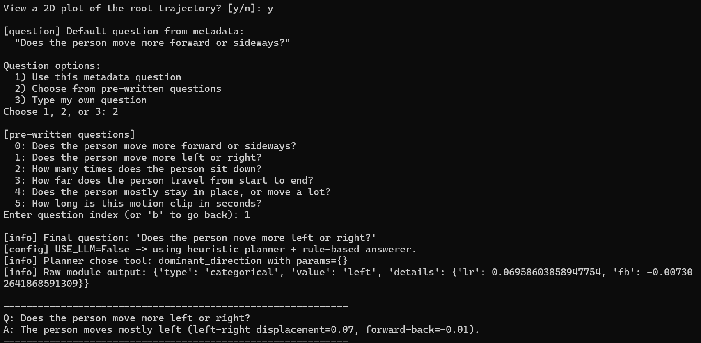

# Lightweight Motion QA (CPU-Only Prototype)

A small, **CPU-friendly Motion Question Answering system** built on top of 3D human motion data (AMASS CMU subset).  

You can:

- Load motion clips from AMASS (CMU, SMPL+H G).
- Preprocess them into a simple internal format.
- Ask questions like:
  - *“Does the person move more forward or sideways?”*
  - *“How many times does the person sit down?”*
  - *“How far does the person travel?”*
  - *“Does the person mostly stay in place, or move a lot?”*
  - *“How long is this clip in seconds?”*
- Interact via a **terminal UI**, with an optional 2D visualization of the root trajectory.

By default, the system runs entirely **offline** without any LLM calls. An optional OpenAI-based planner/answerer path is wired in but disabled with a config flag.

---

## 1. High-Level Overview

**Goal:**  
Build a lightweight Motion QA system that can answer simple, interpretable questions about 3D human motion clips, with:

- No training loop (yet),
- No GPU,
- Simple, modular motion-analysis functions,
- A clean path to plug in LLMs later for planning / answering.

**Core idea:**

1. Use AMASS CMU `.npz` files as input.
2. Extract a **root joint trajectory** for each motion (using the `trans` field → `(T, 1, 3)`).
3. Compute hand-crafted motion features.
4. Run small **tool modules** (e.g., `dominant_direction`, `count_sit_events`, etc.).
5. Use a **planner** to choose which tool to apply for a given question.
6. Use an **answerer** to turn numeric output into human-readable text.


**Output Screens:**


---

## 2. Current Capabilities

### Motion analysis tools (`motion_qa/modules.py`)

Each tool takes `(motion, features, params)` and returns a dictionary like:

```python
{
  "type": "categorical" | "scalar" | "count",
  "value": ...,
  "details": {...}
}
````

Implemented tools:

* `dominant_direction`

  * Uses root displacement to decide if the motion is mostly:

    * `forward`, `backward`, `left`, `right`, or `stationary`.
* `count_sit_events`

  * Uses root/hip height over time to count sit/squat-like events.
* `global_displacement`

  * Computes how far the root moves: `||end - start||` (a scalar distance).
* `displacement_category`

  * Classifies movement amount as:

    * `stationary`, `small`, `medium`, or `large`.
* `clip_duration`

  * Computes clip length in seconds given a frame rate.
* `most_active_limb` (currently more of a stub)

  * Uses per-joint path lengths and `JOINT_GROUPS` to decide which limb moves the most.
  * Fully meaningful once the project is extended to use multi-joint skeletons instead of root-only.

### Features (`motion_qa/features.py`)

* `compute_basic_features(motion)`

  * Root displacement, per-joint path lengths, etc.
* `compute_features_with_events(motion, fps, hip_index)`

  * Builds on the basic features and adds:

    * `sit_event_count` and other event-related signals.

### Planning (`motion_qa/planner.py`)

Two planners:

* `plan_from_question(question, tools)` – **heuristic (default)**

  * Uses keyword rules to choose a tool based on the question text.
  * For example:

    * “sit / squat” → `count_sit_events`
    * “how far / distance / travel” → `global_displacement`
    * “stay in place / move a lot” → `displacement_category`
    * “how long / duration / seconds” → `clip_duration`
    * “forward / left / direction” → `dominant_direction`
* `plan_from_question_llm(question, tools, model)` – **optional LLM-based**

  * Uses an OpenAI model to pick a tool and (optionally) params.
  * Falls back to `plan_from_question` on any error or if LLM is disabled.

### Answering (`motion_qa/answerer.py`)

Two answerers:

* `format_answer(question, tool_name, raw_answer)` – **rule-based (default)**

  * Produces human-readable text like:

    > Q: Does the person move more forward or sideways?
    > A: The person moves mostly left (left-right displacement=3.16, forward-back=-0.00).

  * Has specific formatting for:

    * `dominant_direction`
    * `count_sit_events`
    * `most_active_limb`
    * `global_displacement`
    * `displacement_category`
    * `clip_duration`

* `answer_with_llm(question, tool_name, raw_answer, model)` – **optional**

  * Uses an OpenAI model to turn numeric results into a short explanation.
  * Falls back to `format_answer` if anything goes wrong or LLM is unavailable.

### Configuration (`motion_qa/config.py`)

Config flag:

```python
USE_LLM = os.getenv("USE_LLM", "false").lower() == "true"
```

* When `USE_LLM=false` (default):

  * Planner = heuristic
  * Answerer = rule-based
  * No OpenAI calls are made.
* When `USE_LLM=true`:

  * Planner/answerer try to use OpenAI and fallback on error.

---

## 3. Data Pipeline

### Input data (expected layout)

```text
data/
  CMU/               # AMASS CMU subset (SMPL+H G) .npz files
    01/
      ...
    02/
      ...
    ...
  babel/             # BABEL annotation JSONs (not heavily used yet)
    train.json
    val.json
    test.json
    extra_train.json
    extra_val.json
```

Right now, only **AMASS CMU** is actively used; BABEL JSONs are present to keep the folder structure consistent and for future work.

### Preprocessed subset

Script: `scripts/preprocess_babel_subset.py`

* Recursively scans `data/CMU/` for `.npz`.
* For each file:

  * Loads `joints` if present, otherwise:
  * Loads `trans` and interprets it as a single root joint → `(T, 1, 3)`.
* Computes features and generates basic QA for each clip:

  * “Does the person move more forward or sideways?”
  * “How many times does the person sit down?”
* Saves:

  * `data/babel_subset/motions/<clip_id>.npy`
  * `data/babel_subset/metadata.json`:

    ```json
    [
      {
        "id": "babel_clip_0000",
        "motion_file": "babel_clip_0000.npy",
        "questions": [
          {
            "q": "Does the person move more forward or sideways?",
            "a": "left",
            "type": "dominant_direction"
          },
          {
            "q": "How many times does the person sit down?",
            "a": "0",
            "type": "count_sit_events"
          }
        ]
      },
      ...
    ]
    ```

This gives the project a tiny, self-contained motion QA dataset that mirrors the idea of BABEL but is generated analytically.

---

## 4. Repository Structure

Roughly:

```text
.
├── motion_qa/
│   ├── __init__.py
│   ├── config.py
│   ├── datasets.py
│   ├── features.py
│   ├── modules.py
│   ├── planner.py
│   └── answerer.py
│
├── scripts/
│   ├── preprocess_babel_subset.py
│   ├── run_demo.py
│   └── cli_app.py
│
├── data/
│   ├── CMU/           # AMASS CMU .npz files (not committed)
│   ├── babel/         # BABEL JSON files (not committed)
│   └── babel_subset/  # Generated subset: motions/ + metadata.json
│
├── .env               # config flags, OpenAI key etc. (not committed)
├── requirements.txt   # dependencies (torch, numpy, matplotlib, openai, etc.)
└── README.md          # this file
```

---

## 5. Installation

### 5.1. Python & virtual environment

```bash
# Create and activate a virtual environment
python -m venv .venv
source .venv/bin/activate      # on macOS / Linux
# .venv\Scripts\activate       # on Windows
```

### 5.2. Install dependencies

Minimal set (example; adjust to your actual `requirements.txt`):

```bash
pip install torch numpy matplotlib python-dotenv openai
```

If you maintain a `requirements.txt`, you can instead do:

```bash
pip install -r requirements.txt
```

---

## 6. Setup Data

1. **Download AMASS CMU (SMPL+H G)**

   * Extract such that `.npz` files live under `data/CMU/` (possibly in numbered subfolders like `01/`, `02/`, etc.).

2. (Optional for now) **Download BABEL JSONs**

   * Place them in `data/babel/` with names:

     * `train.json`, `val.json`, `test.json`, `extra_train.json`, `extra_val.json`.

3. Verify:

   ```text
   data/
     CMU/
       01/
         ... .npz
       02/
         ... .npz
       ...
     babel/
       train.json
       val.json
       ...
   ```

---

## 7. Usage

### 7.1. Preprocess AMASS into the project’s subset

From the project root:

```bash
python -m scripts.preprocess_babel_subset
```

This will:

* Traverse `data/CMU/` for `.npz` files (using `joints` or `trans`).
* Generate `data/babel_subset/motions/*.npy`.
* Generate `data/babel_subset/metadata.json`.

You should see logs like:

```text
[info] Found XXX .npz files, selecting ALL of them.
[info] Processing data/CMU/01/xxx.npz
       shape: T=..., J=1
...
[done] Wrote metadata for N clips to data/babel_subset/metadata.json
```

---

### 7.2. Simple demo: one clip, one question

`run_demo.py` is a minimal, non-interactive test:

```bash
python -m scripts.run_demo
```

Example output:

```text
[info] Dataset size: 5
[info] Using item index: 0
[info] Clip ID: babel_clip_0000
[info] Motion shape: (2751, 1, 3) (T, J, 3)
[info] Question: Does the person move more forward or sideways?
[config] USE_LLM=False -> using heuristic planner + rule-based answerer.
[info] Planner chose tool: dominant_direction with params={}
[info] Raw module output: {'type': 'categorical', 'value': 'left', 'details': {'lr': 3.1560, 'fb': -0.004}}

------------------------------------------------------------
Q: Does the person move more forward or sideways?
A: The person moves mostly left (left-right displacement=3.16, forward-back=-0.00).
------------------------------------------------------------
```

This shows the full pipeline is working for a single item.

---

### 7.3. Interactive CLI interface

The main interface is the CLI app:

```bash
python -m scripts.cli_app
```

You’ll see something like:

```text
[setup] Loading MotionQADataset...
[setup] Loaded dataset with N clips.
[config] USE_LLM=False (offline heuristic + rule-based answers).

[clips] There are N clips (0 to N-1).
Enter a clip index to inspect (or 'q' to quit): 0
```

Flow:

1. **Select a clip index** (`0` to `N-1`).

2. See clip summary:

   ```text
   [clip] Index: 0
   [clip] ID: babel_clip_0000
   [clip] Motion shape: (T, J, 3)
   [clip] Summary: T = ..., J = 1 joint(s), net LR displacement ≈ ..., FB displacement ≈ ...
   ```

3. Optionally view a **2D root trajectory plot**:

   ```text
   View a 2D plot of the root trajectory? [y/N]:
   ```

   If you type `y`, a matplotlib window shows `x` vs `z` trajectory.

4. Choose a question:

   ```text
   [question] Default question from metadata:
     "Does the person move more forward or sideways?"

   Question options:
     1) Use this metadata question
     2) Choose from pre-written questions
     3) Type my own question
   ```

   If you choose option 2, you’ll see:

   ```text
   [pre-written questions]
     0: Does the person move more forward or sideways?
     1: Does the person move more left or right?
     2: How many times does the person sit down?
     3: How far does the person travel from start to end?
     4: Does the person mostly stay in place, or move a lot?
     5: How long is this motion clip in seconds?
   ```

5. The system runs:

   * Planner → picks tool
   * Module → computes result
   * Answerer → prints formatted answer

6. After finishing, you can select another clip or quit.

---

## 8. LLM Integration (Optional / Future Use)

If you later have OpenAI API access and want to enable the LLM-based planner/answerer:

1. Create a `.env` file:

   ```env
   OPENAI_API_KEY=sk-...
   USE_LLM=true
   PLANNER_MODEL=gpt-4.1-mini      # or any suitable chat model
   ANSWER_MODEL=gpt-4.1-mini
   ```

2. Make sure `python-dotenv` and `openai` are installed.

3. Run the CLI or demo as before:

   ```bash
   python -m scripts.cli_app
   ```

The project will:

* Use `plan_from_question_llm` instead of the heuristic planner.
* Use `answer_with_llm` instead of `format_answer` where possible.
* Fall back to heuristic behavior if any error occurs.

---

## 9. Limitations & Future Work

**Current limitations:**

* Uses only the **root joint** (`trans`) from AMASS, not full skeleton joints.
* **No learned model** is trained yet; everything is rule-based / feature-based.
* BABEL labels are not yet fully integrated (only mirrored structurally).
* `most_active_limb` is limited in meaning until multi-joint data is used.

**Future directions:**

* Add **SMPL-H-based joint reconstruction** to get full `(T, J, 3)` skeletons.
* Make `most_active_limb` and other limb-based tools fully meaningful.
* Train a small **classifier** (e.g., movement intensity, action type) on top of the features → make this clearly a Machine Learning project.
* Use BABEL text for:

  * richer question templates,
  * training a simple text–motion classifier/regressor.
* Build a **web UI** (e.g., Streamlit/Gradio) as a richer front-end.

---

## 10. How to Talk About This Project

Example blurb for a CV / portfolio:

> Implemented a CPU-only Motion Question Answering prototype on AMASS CMU data.
> Built a preprocessing pipeline that extracts root joint trajectories from AMASS `.npz` files, computes interpretable motion features (displacement, sit events, duration), and generates a small BABEL-style QA dataset. Designed a modular toolbox of motion-analysis functions (dominant direction, sit counts, displacement, movement category, duration) with a planner–answerer architecture and an interactive terminal UI, with optional LLM integration for tool selection and answer generation.

---


